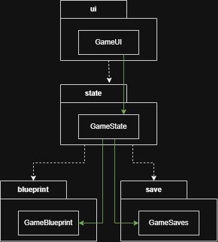

# Architecture

## Package Diagram

(Each package is described in detail inside their respective READMEs (for ex. src/ui/README.md) )

Each package has a primary class which is injected as a dependency.

- Package _ui_ contains pygame UI code
- Package _state_ contains objects to control the game's state
- Package _blueprint_ contains code to load game configuration
- Package _save_ contains code to load player saves
