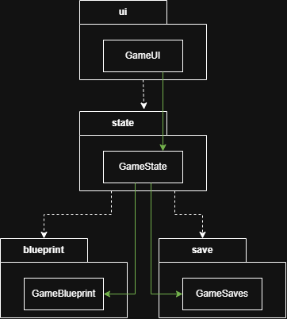

# Architecture

## Package Diagram



(Each package is described in detail inside their respective READMEs (for ex. src/ui/README.md) )

Each package has a primary class which is injected as a dependency.

- Package _ui_ contains pygame UI code
- Package _state_ contains objects to control the game's state
- Package _blueprint_ contains code to load game configuration
- Package _save_ contains code to load player saves

## Overview

Here we'll go over each of the packages and describe what role they have in the game.

### Blueprint

> Blueprints represent the game's schema. The main GameBlueprint contains all of the items, machines, tiles and constants.

Blueprints are loaded from JSON into a single `GameBlueprint` class. 
`GameBlueprint` class has helper class methods to create instances of itself from either raw JSON or from a file.
The helper methods also perform validation on the provided config and raise an exception if it finds any issues.
The possible issues are:

- Non-unique IDs (two items or an item and a machine cannot have the same ID)
- References exist (all recipe IDs referenced in a machine should actually exist as recipes)
- Elements should have appropriate sprites (all items have a main sprite and some, like crops, have extra growth stage sprites)

The primary blueprint consists of:

```json
{
  "constants": {...} // variables, constants
  "sprites": {...} // mappings of bitmap sprites in an 8x8 grid
  "recipes": {...} // all items, their recipes and properties
  "machines": {...} // machine properties, namely defining which recipes they can craft
}
```

For each category, there is a separate blueprint class, along with any required types defined in [`src/blueprint/blueprints.py`](https://github.com/Septicuss/hy-ot-harjoitustyo/blob/main/src/blueprint/blueprints.py). Nearly all classes there handle
deserialization from JSON into the class itself via a `@classmethod from_dict`.

Additionally `GameBlueprint` class has some useful utility methods, 
like checking matching recipes against a list of items or
checking how many max inventory slots does a machine need based on its blueprint.


### Save

> The game loads and saves its state data as JSON files in a hardcoded location.

Saves are pretty simple. There is a serializable (JSON <-> dict) `GameSave` class, which holds
the save data. And to keep track of, load and save `GameSave` instances there is a `GameSaves` class.
Saves are based on a slot system - each slot saves to its own `save_[slot].json` file in the hardcoded save directory. 
Currently the game does not use more than slot 1 (but has the capacity to).

`GameSaves` is fully managed by the `GameState` below and is only used as a save loading/saving tool at runtime. 

### State

> The state package handles the entire games logic. It ticks the machines & orders, and handles player input & transactions.

The game works by having a single `GameState` class. 
The class gets instances of a loaded `GameBlueprint` and a loaded `GameSaves` classes.
The state tracks:
- Player state via `Player` class
- Order state via `Orders` class
- The game world, keeping a dictionary of all tiles `dict[int, Machine]` and locked tiles `list[int]`
- The save via `GameSaves` class, triggering autosaves every 10 minutes


### UI

The UI is handled in a single `GameUI` class with `GameState` as a dependency. 
`GameUI` uses blueprints and the state to render the UI. 

The UI interact with the state through:
- calling `GameState#update(delta: float)`, which in turn propagates the updates to machines, orders and for example the autosave timer.
Machines use the delta to calculate when recipes are complete using a timer.
- calling machine functions, like `Machine#add_item()` and `Machine#collect()` to collect ready items
- calling order functions, like `Orders.submit_one()` to submit an item to an order
- calling `GameState#save()` to save the game when pygame receives an exit event

Most such UI <-> state functions modify the state and return a success value. 
The UI reacts to state changes mostly by checking if cached values have changed (like re-rendering coins in the HUD) 
For example items submitted to an order must match by ID.

Architecturally, the UI is built out of `UIElement`s. 
All UI elements inherit the `UIElement` class.
`UIElements` are kept track of in `GameUI`, 
and within the games ticking loop (60fps), calls `UIElement#update(delta_time)` and `UIElement#draw(surface)` 
for elements to check for state updates and then draw the results. 
Elements also have QOL features like having an integer based draw order `UIElement#order() -> int`
