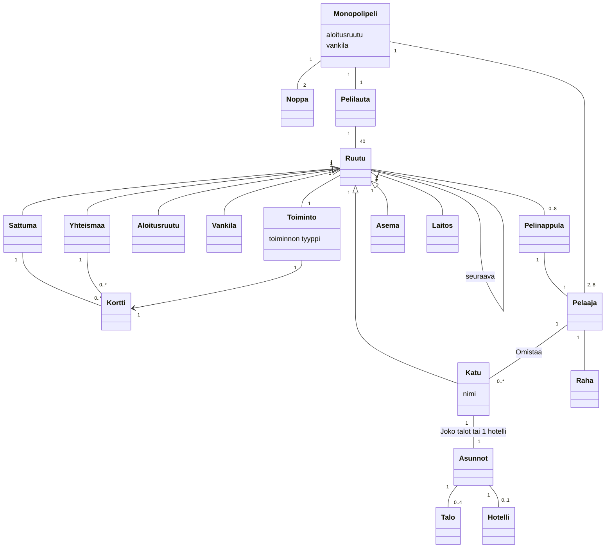

## Monopoli, alustava luokkakaavio

```mermaid
 classDiagram
     class Monopolipeli {
        aloitusruutu
        vankila
     }
     
     class Toiminto {
         toiminnon tyyppi
     }
     class Katu {
         nimi 
     }
    
    Monopolipeli "1" -- "2" Noppa
    Monopolipeli "1" -- "1" Pelilauta
    Pelilauta "1" -- "40" Ruutu
    Ruutu "1" -- "1" Ruutu : seuraava
    Ruutu "1" -- "0..8" Pelinappula
    
    Ruutu "1" <|-- Aloitusruutu
    Ruutu "1" <|-- Vankila
    Ruutu "1" <|-- Sattuma
    Ruutu "1" <|-- Yhteismaa
    Ruutu "1" <|-- Asema
    Ruutu "1" <|-- Laitos
    Ruutu "1" <|-- Katu
    
    Ruutu "1" -- "1" Toiminto
    
    Sattuma "1" -- "0..*"Kortti
    Yhteismaa "1" -- "0..*"Kortti
    
    Toiminto "1" --> "1" Kortti
    
    Pelinappula "1" -- "1" Pelaaja
    Pelaaja "2..8" -- "1" Monopolipeli
    Pelaaja "1" -- Raha
    Pelaaja "1" -- "0..*" Katu : Omistaa
    
    Katu "1" -- "1" Asunnot : Joko talot tai 1 hotelli
    Asunnot "1" --  "0..4" Talo
    Asunnot "1" -- "0..1" Hotelli
    
```